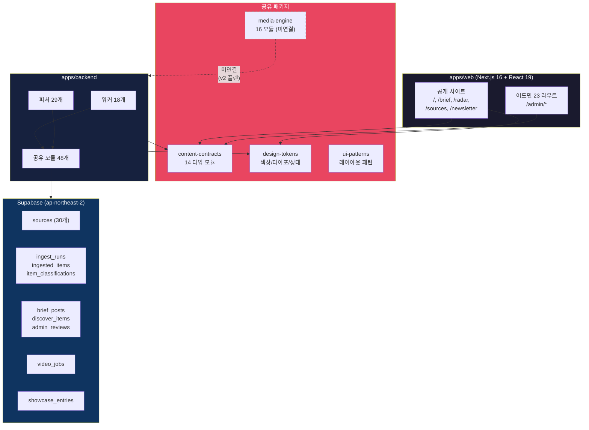
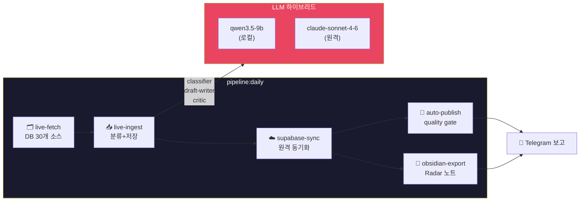
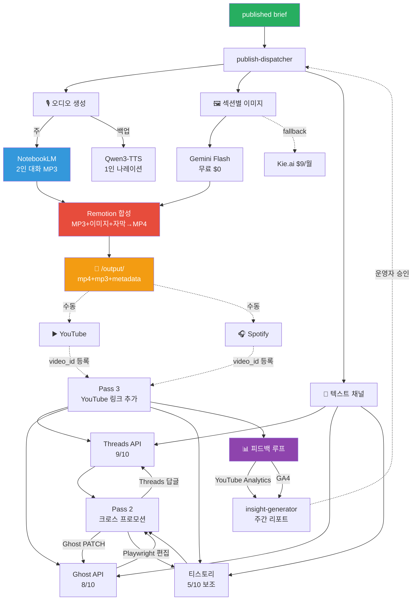
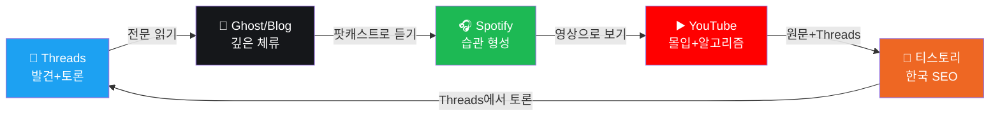
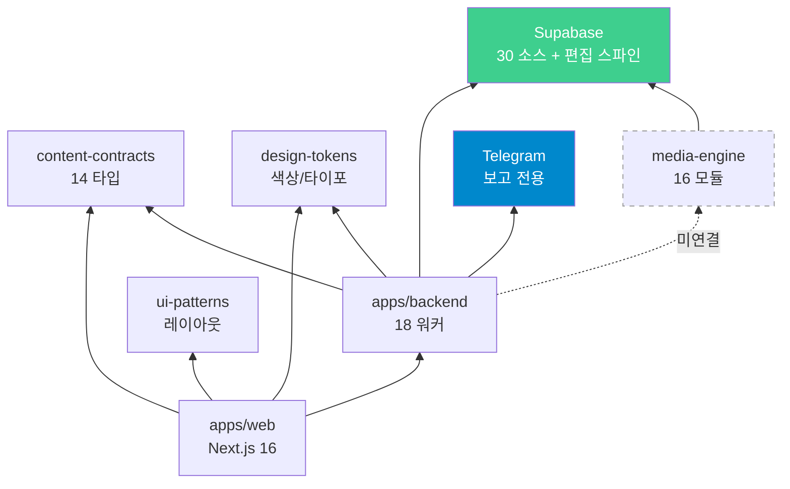

# VibeHub 전체 자동화 파이프라인 다이어그램

> 최종 갱신: 2026-03-26

## 범례

| 표기 | 의미 |
|------|------|
| `[████]` | 구현 완료 + 운영 중 |
| `[▓▓▓▓]` | 이번에 신규 연결 |
| `[░░░░]` | 설계 완료 + 미구현 |
| `────` | 자동 연결 |
| `- - -` | 수동 연결 (운영자 개입) |

---

## 1. 전체 파이프라인 맵

```
═══════════════════════════════════════════════════════════════════════════

  ┌─────────────── 소스 관리 (▓▓▓▓ DB SSOT 연결) ─────────────────────┐
  │                                                                      │
  │  [████ Supabase sources 테이블] ← 어드민 UI에서 on/off 관리         │
  │  30개 소스 (RSS 25개 + GitHub Releases 5개)                         │
  │         │                                                            │
  │         ▼                                                            │
  │  [▓▓▓▓ loadSourcesFromDb()]  DB → live-fetch 직결                   │
  │  (fallback: 하드코딩 3개, DB 연결 실패 시)                          │
  │                                                                      │
  └──────────────────────────────────────────────────────────────────────┘
                              │
                              ▼
  ┌─────────────────── 수집·정제 (████ 구현 완료) ──────────────────────┐
  │                                                                      │
  │  [████ pipeline:live-fetch]                                          │
  │  DB 30개 소스 → RSS/GitHub API fetch → Defuddle enrichment          │
  │         │                                                            │
  │         ▼                                                            │
  │  [████ pipeline:live-ingest]                                         │
  │  sources / ingest_runs / ingested_items / item_classifications       │
  │         │                                                            │
  │         ▼                                                            │
  │  [████ pipeline:supabase-sync]                                       │
  │  로컬 snapshot → Supabase 원격 동기화 (UUID 매핑)                   │
  │         │                                                            │
  │         ▼                                                            │
  │  [████ pipeline:obsidian-export]                                     │
  │  discover 항목 → Obsidian vault + Telegram 보고                     │
  │                                                                      │
  └──────────────────────────────────────────────────────────────────────┘
                              │
                              ▼
  ┌─────────── LLM 오케스트레이션 (████ 구현 완료) ────────────────────┐
  │                                                                      │
  │  하이브리드: qwen3.5-9b (로컬) + claude-sonnet-4-6 (원격)           │
  │                                                                      │
  │  [████ classifier]        target_surface 분류                        │
  │  [████ draft-writer]      brief/discover 초안 생성                   │
  │  [████ critic]            quality check 6항목                        │
  │  [████ trial:all]         shadow trial 4 stages                     │
  │                                                                      │
  └──────────────────────────────────────────────────────────────────────┘
                              │
                              ▼
  ┌──────────── 편집·발행 관리 (████ 구현 완료) ───────────────────────┐
  │                                                                      │
  │  [████ review:decision]     approve / changes_requested / reject     │
  │  [████ publish:action]      schedule / publish                       │
  │  [████ publish:auto]        approved → quality gate → published      │
  │  [████ publish:repair-state]  상태 무결성 자동 복구                  │
  │  [████ automation:check]    문서-스크립트 drift 검사                 │
  │                                                                      │
  │  일일 자동화: [████ pipeline:daily]                                  │
  │  fetch(30개) → ingest → sync → export → auto-publish                │
  │                                                                      │
  └──────────────────────────────────────────────────────────────────────┘
                              │
                              │  brief 상태: published ✅
                              │
══════════════════════ 이하 미구현 (v2 플랜) ════════════════════════════
                              │
                              ▼
  ┌──────────── 오디오 생성 (P2, ░░░░) ────────────────────────────────┐
  │                                                                      │
  │  [░░░░ notebooklm-bridge.ts]   주: 2인 대화 팟캐스트                │
  │  [░░░░ qwen3-client.ts]        백업: 1인 나레이션                   │
  │                                                                      │
  └──────────────────────────────────────────────────────────────────────┘
                              │
                              ▼
  ┌──────── 섹션별 이미지 생성 (P3a, ░░░░) ────────────────────────────┐
  │                                                                      │
  │  [████ brief-parser.ts]     섹션 분리 + imageSlot (구현됨)          │
  │  [░░░░ gemini-image.ts]     Gemini Flash 무료 $0/월                 │
  │  [████ normalize.ts]        WebP 1920x1080 리사이즈 (구현됨)        │
  │  fallback: [████ kie-provider.ts] Kie.ai $9/월 (구현됨)            │
  │                                                                      │
  └──────────────────────────────────────────────────────────────────────┘
                              │
                              ▼
  ┌──────────── 영상 합성 (P3b, ░░░░) ─────────────────────────────────┐
  │                                                                      │
  │  [████ render-spawn.ts]     Remotion CLI spawn (구현됨, 개인 무료)  │
  │  [░░░░ BriefPodcast.tsx]    Remotion Composition (미구현)           │
  │  MP3 + 섹션 이미지 + Whisper 자막 → MP4 (16:9 + 9:16)              │
  │         │                                                            │
  │         ▼                                                            │
  │  /output/{date}-{slug}/                                              │
  │    ├─ video-16x9.mp4        YouTube 일반                             │
  │    ├─ video-9x16.mp4        YouTube Shorts / Threads                 │
  │    ├─ audio.mp3             Spotify / Apple Podcasts                 │
  │    ├─ thumbnail.jpg         YouTube 썸네일                           │
  │    └─ metadata.json         제목/설명/태그/크로스프로모              │
  │                                                                      │
  └──────────────────────────────────────────────────────────────────────┘
                              │
                              ▼
  ┌─────── 채널 발행 Pass 1 (P1,P4,P7, ░░░░) ─────────────────────────┐
  │                                                                      │
  │  자동 채널 (publish:channels)                                        │
  │  ├─ [░░░░ threads-publisher.ts]    Threads API (P1, 9/10)           │
  │  │       brief 요약 500자 + 커버이미지 → 포스트                     │
  │  ├─ [░░░░ ghost-publisher.ts]      Ghost API (P4, 8/10)             │
  │  │       brief 전문 HTML + 오디오 embed                             │
  │  └─ [░░░░ tistory-publisher.ts]    Playwright (P7, 5/10, 보조)     │
  │          brief 전문 HTML, 하루 2~3건                                 │
  │                                                                      │
  │  - - - - - - - - - - - - - - - - - - - - - - - - - - - - - - - -    │
  │  반자동 채널 (운영자 직접)                                           │
  │  ├─ YouTube:  mp4 → YouTube Studio 드래그&드롭                      │
  │  │            metadata.json 설명란 복사-붙여넣기                     │
  │  └─ Spotify:  mp3 → Spotify for Creators 업로드                     │
  │               Spotify 자동 RSS → Apple Podcasts / YouTube 연동       │
  │                                                                      │
  └──────────────────────────────────────────────────────────────────────┘
                              │
                              ▼
  ┌─────── 크로스 프로모션 Pass 2+3 (P6, ░░░░) ───────────────────────┐
  │                                                                      │
  │  [░░░░ cross-promo-sync.ts]                                         │
  │                                                                      │
  │  Pass 2 (자동): 수집된 URL로 상호 링크                              │
  │  ├─ Threads  → reply_to_id 답글 (편집 API 없음)                     │
  │  ├─ Ghost    → API PATCH 하단 프로모션 블록                         │
  │  └─ 티스토리  → Playwright 편집                                      │
  │                                                                      │
  │  Pass 3 (비동기): 운영자 YouTube/Spotify 업로드 후                  │
  │  └─ publish:link-youtube → 나머지 채널에 링크 추가                   │
  │                                                                      │
  └──────────────────────────────────────────────────────────────────────┘
                              │
                              ▼
  ┌─────── 피드백 루프 (P8~P9, ░░░░) ──────────────────────────────────┐
  │                                                                      │
  │  [░░░░ analytics-collector.ts]  주 1회 cron                         │
  │  ├─ YouTube Analytics API → views, CTR, retention                   │
  │  ├─ GA4 Data API → blog/tistory pageviews                          │
  │  └─ → Supabase channel_metrics 저장                                 │
  │                                                                      │
  │  [░░░░ insight-generator.ts]    주 1회                              │
  │  ├─ 상위 20% brief 특성 분석                                        │
  │  ├─ 주간 리포트 → Telegram 발송                                     │
  │  └─ 프롬프트/템플릿/음성 조정 제안 (운영자 승인)                    │
  │                                                                      │
  └──────────────────────────────────────────────────────────────────────┘

═══════════════════════════════════════════════════════════════════════════
```

---

## 2. 트래픽 순환 맵 (크로스 프로모션)

```
    Threads (발견) ──"전문 읽기"──► Ghost/Blog (체류)
         ▲                              │
         │                        "팟캐스트로 듣기"
    "의견 나누기"                        │
         │                              ▼
         └──────────────── Spotify (습관) ──"영상으로 보기"──► YouTube (몰입)
                                                                  │
                                                            "원문+Threads"
                                                                  │
                                                                  ▼
                                                          티스토리 (SEO)
                                                      "Threads에서 토론" ──► Threads
```

---

## 3. 구현 현황 요약

| 영역 | 모듈 수 | 상태 | 비고 |
|------|---------|------|------|
| 소스 관리 | DB 30개 | ▓▓▓▓ 신규 연결 | 하드코딩 3개 → DB 30개 SSOT |
| 수집·정제 | 워커 4개 | ████ 100% | live-fetch → ingest → sync → export |
| LLM 오케스트레이션 | trial 4 + 3 agent | ████ 100% | qwen3.5-9b + claude-sonnet-4-6 hybrid |
| 편집·발행 관리 | 워커 5개 + daily | ████ 100% | auto-publish + repair-state |
| media-engine 기존 | 16개 모듈 | ████ 구현됨 | 백엔드에서 미연결 (import 0) |
| 오디오 생성 | 2개 | ░░░░ P2 | NotebookLM (주) + Qwen3-TTS (백업) |
| 섹션별 이미지 | 2개 (+기존 3개) | ░░░░ P3a | Gemini Flash 무료 $0 |
| 영상 합성 | 1개 (+기존 1개) | ░░░░ P3b | Remotion, 개인 무료 |
| 채널 발행 | 6개 | ░░░░ P1,P4,P5,P7 | Threads(9/10), Ghost(8/10), 티스토리(5/10) |
| 크로스 프로모션 | 2개 | ░░░░ P6 | 2-pass + YouTube 비동기 3rd pass |
| 피드백 루프 | 2개 | ░░░░ P8~P9 | YouTube Analytics + GA4 |

---

## 4. 경계선

```
published 상태
─────────────────────────────────────────────────────────
  ◄── 구현 완료 (18 워커 + 30 소스) ──►│◄── 미구현 (v2) ──►
  소스 → 수집 → 분류 → 초안 → 검수 → 발행  │  오디오 → 이미지 → 영상 → 채널 → 피드백
```

---

## 5. 구현 우선순위 (CHANNEL-PUBLISH-PIPELINE v2)

| Phase | 내용 | 실현성 | 상태 |
|-------|------|--------|------|
| P1 | Threads API 연동 | 9/10 | ░░░░ |
| P2 | NotebookLM → 팟캐스트 MP3 | 7/10 | ░░░░ |
| P3a | Gemini 섹션별 이미지 ($0) | 9/10 | ░░░░ |
| P3b | Remotion Composition (무료) | 7.5/10 | ░░░░ |
| P4 | Ghost/WP API | 8/10 | ░░░░ |
| P5 | Spotify 메타데이터 | 8/10 | ░░░░ |
| P6 | 크로스 프로모션 2-pass | — | ░░░░ |
| P7 | 티스토리 Playwright (보조) | 5/10 | ░░░░ |
| P8 | YouTube Analytics + GA4 | 8/10 | ░░░░ |
| P9 | insight-generator 주간 리포트 | 7/10 | ░░░░ |

---

## 6. Mermaid: 프로젝트 전체 아키텍처



## 7. Mermaid: 일일 파이프라인 흐름



## 8. Mermaid: 채널 발행 파이프라인 (v2, 미구현)



## 9. Mermaid: 크로스 프로모션 트래픽 순환



## 10. Mermaid: 패키지 의존성



---

## 참고 문서
- `docs/ref/CHANNEL-PUBLISH-PIPELINE.md` — 채널 발행 v2 전체 명세
- `docs/ref/PIPELINE-OPERATING-MODEL.md` — 수집→가공→초안→검수→배포 흐름
- `docs/ref/AGENT-OPERATING-MODEL.md` — 에이전트 역할 분담
- `docs/ref/SOURCE-CATALOG.md` — 소스 카탈로그 (DB 현황 동기화됨)
- `docs/ref/LLM-ORCHESTRATION-MAP.md` — LLM 역할 매핑
- `docs/status/EXECUTION-CHECKLIST.md` — 실행 체크리스트
